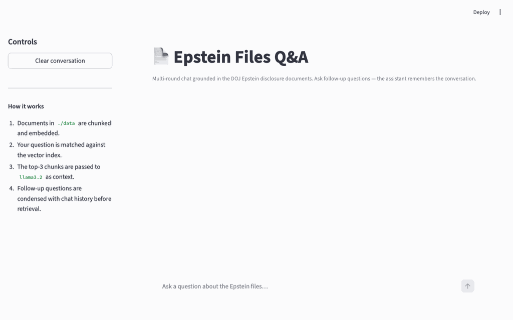

# Epstein Files Q&A

A simple end-to-end **Retrieval-Augmented Generation (RAG)** example built on a real-world dataset: the [DOJ Epstein disclosure documents](https://www.justice.gov/epstein/doj-disclosures/data-set-12-files). Ask multi-round questions against declassified PDFs entirely on your local machine — no cloud LLM calls, no data leaving your device.



## Objective

This project demonstrates a complete local RAG pipeline:

1. **Download** real PDF documents from a public government website (with browser-based age verification handled automatically)
2. **Chunk & embed** the documents using a local embedding model
3. **Query** with a local LLM that retrieves relevant passages and synthesises grounded answers
4. **Chat** in multiple rounds — follow-up questions carry full conversation context

It is intentionally kept simple: one config file, one RAG module, one Streamlit app, and one exploratory notebook.

## Tech Stack

| Layer | Tool | Purpose |
|---|---|---|
| **Package manager** | [uv](https://docs.astral.sh/uv/) | Fast Python env & dependency management |
| **RAG framework** | [LlamaIndex](https://www.llamaindex.ai/) | Document loading, chunking, indexing, querying |
| **Local LLM** | [Ollama](https://ollama.com/) + `llama3.2` | Answer generation, runs fully offline |
| **Embeddings** | [Ollama](https://ollama.com/) + `nomic-embed-text` | Semantic vector search |
| **Frontend** | [Streamlit](https://streamlit.io/) | Multi-round chat UI in the browser |
| **PDF downloader** | [Playwright](https://playwright.dev/python/) | Headless browser to handle age-gate |
| **Exploration** | [JupyterLab](https://jupyterlab.readthedocs.io/) | Step-by-step notebook walkthrough |

## Project Structure

```
epstein_files_qna/
├── src/
│   ├── config.py          # All configuration (models, paths, chunking params)
│   ├── rag.py             # Index build/load, query engine & chat engine factories
│   └── download.py        # Playwright-based PDF downloader
├── notebooks/
│   └── rag_workflow.ipynb # 9-section exploratory notebook
├── app.py                 # Streamlit multi-round chat frontend
├── data/                  # Documents (PDFs are gitignored, downloaded locally)
│   ├── sample.txt         # Sample plain-text doc for testing
│   └── sample.md          # Sample markdown doc for testing
├── storage/               # Persisted vector index (gitignored, built locally)
├── pyproject.toml         # uv project definition & dependencies
└── uv.lock                # Locked dependency versions
```

## Prerequisites

Install the following before starting:

- **Python 3.10+**
- **[uv](https://docs.astral.sh/uv/getting-started/installation/)** — `curl -LsSf https://astral.sh/uv/install.sh | sh`
- **[Ollama](https://ollama.com/download)** — download and install the macOS/Linux app

## Step-by-Step Setup

### 1. Clone the repo

```bash
git clone https://github.com/jeffersonqiu/epstein_files_qna.git
cd epstein_files_qna
```

### 2. Install dependencies

```bash
uv sync
```

This reads `pyproject.toml` + `uv.lock` and creates a `.venv` with all packages pinned to exact versions.

### 3. Start Ollama and pull models

In a **separate terminal**, start the Ollama server and keep it running:

```bash
ollama serve
```

In another terminal, pull the required models:

```bash
ollama pull llama3.2
ollama pull nomic-embed-text
```

### 4. Create the memory-efficient LLM variant

`llama3.2` defaults to a 128k context window (~14 GB KV cache). This one-time command creates a variant capped at 4096 tokens — sufficient for RAG and fits comfortably in memory:

```bash
ollama create llama3.2-4k -f - <<'EOF'
FROM llama3.2
PARAMETER num_ctx 4096
EOF
```

### 5. Download the Epstein PDF documents

```bash
uv run python src/download.py
```

A browser window will open. If an age-verification prompt appears, click **Yes**. Once the document listing is visible, press **Enter** in the terminal. The script will then scrape all pages and download PDFs into `./data/`.

> PDFs are gitignored and must be downloaded locally by each user.

### 6. Run the Streamlit chat app

```bash
uv run streamlit run app.py
```

Opens at `http://localhost:8501`. On the first run, the app builds and persists the vector index (takes a few minutes). Subsequent runs load from disk instantly.

**Features:**
- Multi-round conversation with memory of prior turns
- Source attribution (file name + similarity score + excerpt) for each answer
- "Clear conversation" button to start fresh

### 7. (Optional) Explore the notebook

```bash
uv run jupyter lab notebooks/rag_workflow.ipynb
```

> Always launch from the **project root**, not from inside `notebooks/`.

The notebook walks through the full pipeline in 9 sections:

| Section | What it covers |
|---|---|
| 1 | Imports |
| 2 | Configuration |
| 3 | LLM & embedding init + connectivity checks |
| 4 | Document loading |
| 5 | Index creation with persistence |
| 6 | Query engine setup |
| 7 | Interactive Q&A demo + source attribution |
| 8 | Streaming responses |
| 9 | Multi-round chat engine |

## Configuration

All tuneable parameters live in a single file — `src/config.py`:

```python
LLM_MODEL     = "llama3.2-4k"     # Ollama model for answer generation
EMBED_MODEL   = "nomic-embed-text" # Ollama model for embeddings
NUM_CTX       = 4096               # Context window (tokens)
CHUNK_SIZE    = 512                # Characters per document chunk
CHUNK_OVERLAP = 50                 # Overlap between consecutive chunks
TOP_K         = 3                  # Number of chunks retrieved per query
```

## How RAG Works (in this project)

```
PDF files → chunk → embed → vector index (stored in ./storage/)
                                    ↓
User question → embed → similarity search → top-3 chunks
                                    ↓
         [chunks + question + chat history] → llama3.2 → answer
```
